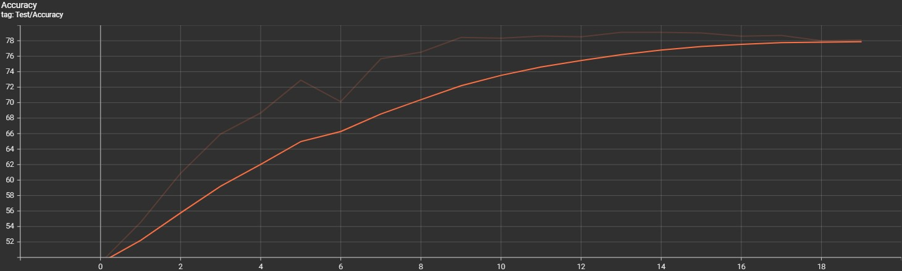
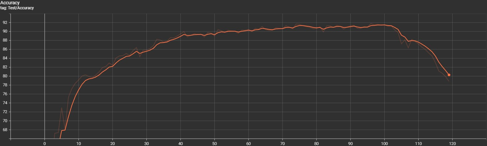

# DivideMix + JoSRC: Robust Learning with Noisy Labels

A PyTorch implementation combining **DivideMix**'s semi-supervised learning framework with **JoSRC**'s sample selection methodology for improved performance on noisy-label datasets.

## Overview

This project integrates two state-of-the-art approaches for learning with noisy labels:

- **DivideMix** (Li et al., ICLR 2020): A semi-supervised learning framework that divides training data into clean and noisy subsets using Gaussian Mixture Models, then trains with MixMatch.

- **JoSRC** (Yao et al., CVPR 2021): A contrastive approach using Jensen-Shannon divergence for sample selection and mean-teacher networks for pseudo-labeling.

### Key Features

- **JS Divergence Sample Selection**: Replaces GMM with global sample selection based on prediction-label consistency
- **Mean Teacher Networks**: Generates reliable pseudo-labels for detected noisy samples
- **Consistency Regularization**: Encourages agreement between augmented views
- **Co-training**: Two networks train on each other's sample selections for robustness

## Installation

### 1. Clone the repository
```bash
git clone https://github.com/tyler543/Contrastive-DivideMix.git
cd Contrastive-DivideMix
```

### 2. Create conda environment
```bash
conda create -n {name} python=3.8
conda activate {name}
```

### 3. Install dependencies
```bash
pip install -r requirements.txt
```

### 4. Download CIFAR-10 dataset

The dataset will be automatically downloaded on first run, or manually download to `./cifar-10/`

### 5. Prepare noise files

Noise files should be in the format: `./cifar-10/{noise_rate}_{noise_mode}.json`

Example: `./cifar-10/0.5_sym.json` for 50% symmetric noise

Note: This project only contains the file for noise_rate at 0.5 and a symmetrical noise mode
### Basic Training
```bash
python main.py
```

### Custom Hyperparameters example
```bash
python main.py \
  --num_epochs 120 \
  --warmup_epochs 10 \
  --tau_clean 0.5 \
  --consistency_lambda 0.5 \
  --batch_size 64 \
  --lr 0.02
```

### Key Arguments

| Argument | Default | Description |
|----------|---------|-------------|
| `--num_epochs` | 300 | Total training epochs |
| `--warmup_epochs` | 10 | Warmup epochs before sample selection |
| `--tau_clean` | 0.5 | Threshold for clean sample selection |
| `--consistency_lambda` | 0.5 | Weight for consistency regularization |
| `--ema_decay` | 0.99 | EMA decay rate for mean teacher |
| `--r` | 0.5 | Noise rate |
| `--noise_mode` | sym | Noise type: 'sym' or 'asym' |
| `--batch_size` | 64 | Batch size |
| `--lr` | 0.02 | Learning rate |

### Example Runs
```bash
# Quick test (120 epochs)
python main.py --num_epochs 120 --warmup_epochs 10


## Monitoring with TensorBoard (in vs code)

### Start TensorBoard 

In a separate terminal:
```bash
cd DivideMix-JoSRC
python -m tensorboard.main --logdir ./runs/cifar10_0.5_sym_josrc/epochs={xx}_warmup={xx}_tau={xx}
```

Then open your browser to: `http://localhost:6006`

### View Specific Run
```bash
python -m tensorboard.main --logdir ./runs/cifar10_0.5_sym_josrc/epochs=120_warmup=10_tau=0.5
```

### Metrics Logged

- Train/Labeled_Loss
- Train/Unlabeled_Loss
- Train/Consistency_Loss
- Train/Total_Loss
- Test/Accuracy

## Results

### CIFAR-10 with 50% Symmetric Noise

I compared the DivideMix methodology with my enhanced version with Jo-SRC implementation with two trials, the first experiment was a short 20 epoch run and the second was a 120 epoch run.

#### Experiment 1: 20 epochs

Training Epochs = 20
Warmup Epochs = 10
Final Test Accuracy = 79.09%




#### Experiment 2: 120 epochs

Training Epochs = 120
Warmup Epochs = 10
Final Test Accuracy = 79.84%
Highest Test Accuracy = 91.79% (epoch 103)



## Acknowledgments

This project combines two methods for learning with noisy labels:

### DivideMix
- **Paper**: [DivideMix: Learning with Noisy Labels as Semi-supervised Learning](https://openreview.net/forum?id=HJgExaVtwr)
- **Authors**: Junnan Li, Richard Socher, Steven C.H. Hoi
- **Conference**: ICLR 2020
- **GitHub**: [https://github.com/LiJunnan1992/DivideMix](https://github.com/LiJunnan1992/DivideMix)

### JoSRC
- **Paper**: [Jo-SRC: A Contrastive Approach for Combating Noisy Labels](https://openaccess.thecvf.com/content/CVPR2021/html/Yao_Jo-SRC_A_Contrastive_Approach_for_Combating_Noisy_Labels_CVPR_2021_paper.html)
- **Authors**: Yazhou Yao, Zeren Sun, Chuanyi Zhang, Fumin Shen, Qi Wu, Jian Zhang, Zhenmin Tang
- **Conference**: CVPR 2021
- **GitHub**: [https://github.com/NUST-Machine-Intelligence-Laboratory/Jo-SRC](https://github.com/NUST-Machine-Intelligence-Laboratory/Jo-SRC)

Both projects are licensed under the MIT License.